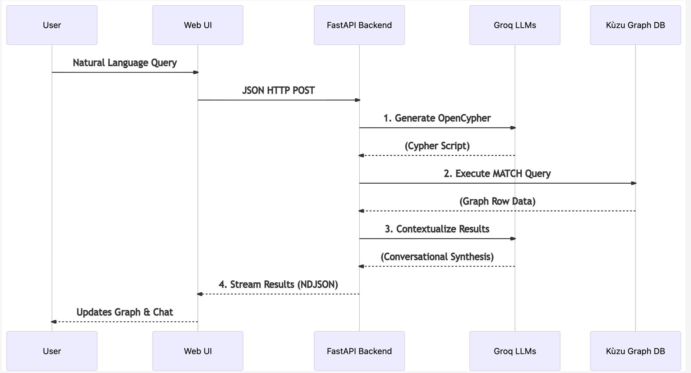

# Context Graph System

This project is a context graph system that allows you to interactively explore an ERP dataset (Sales Orders, Deliveries, Billing, Customers, Products, etc.) using a 3D/2D visual graph and query it via a natural language Chat Interface powered by an LLM.

## Features

- **Data Ingestion**: Parses JSONL files and dynamically creates a native **Kùzu Graph** database structure (`context_graph_kuzu`).
- **Graph Modeling**: Intelligently converts legacy relational ERP data explicitly into multi-hop Graph relationships (Nodes and Edges).
- **Graph Visualization**: A modern glassmorphism UI utilizing `react-force-graph` (via vanilla JS) to natively explore graph topologies using Cypher backend queries.
- **Streaming Conversational AI**: Takes natural language queries, dynamically translates them into **OpenCypher** using Groq's LLM API, streams the executable queries to the UI, and streams natural language contextualized answers back instantly via NDJSON.
- **Guardrails**: Strictly constrained to answer questions related only to the provided dataset domain. Rejects unrelated or creative prompts.

## Demo Video
*(Link to the project walkthrough video goes here)*

## Architecture Diagram



## Architecture Decisions

1. **Backend**: Built with **FastAPI** (`main.py`) to provide a lightweight, high-performance web server, streaming dual-channel UI payloads natively using `application/x-ndjson`.
2. **Frontend**: A custom **Vanilla JS/HTML/CSS** application served directly by FastAPI. It has a split-screen design. The CSS implements modern glassmorphism and subtle glowing aesthetics for a visually premium experience without bloated UI frameworks.
3. **Database Choice**: 
   - We transitioned to **Kùzu**, an embedded, high-performance open-source native property graph database (`context_graph_kuzu`). Kùzu was selected because evaluating ERP multi-hop supply chain relations (e.g., tracking a Customer's Order to a specific Plant Delivery) is extremely complex and computationally expensive to traverse using repetitive SQL `JOIN` constraints.
   - Utilizing a native Graph layer unlocks lightning-fast topology execution (`MATCH (c:Customer)-[:PLACED]->(s:SalesOrder)-[:FULFILLS]->...`) and fundamentally simplifies logical AI query construction parameters.
4. **LLM Prompting Strategy**: 
   - **Text-to-Cypher Generation**: The primary prompt passes the complete Kùzu Node and Relationship catalog directly into the system context. It explicitly bounds the LLM to write logically sound, optimized **OpenCypher** traversal scripts.
   - **Data-Backed Summarization**: Once the backend executes the OpenCypher query natively inside Kùzu, the output row payloads are fed immediately to a secondary LLM inference prompt to contextualize and stream the result logically back to the user. This effectively prevents data hallucination.
5. **Guardrails**:
   - The System Prompts inject a strict programmatic rule enforcing domain boundaries.
   - If a prompt asks for general knowledge, creative writing, or external topics, the LLM is forcibly instructed to halt Cypher logic and reply with the exact phrase: *"This system is designed to answer questions related to the provided dataset only."*
   - The FastAPI backend checks for this specific sequence and short-circuits execution if caught, preventing database strain and guaranteeing query grounding.

## Setup & Running Locally

### Prerequisites
- Python 3.9+
- Provide a free API key from [Groq](https://console.groq.com/keys)

### Installation

1. Install requirements:
   ```bash
   pip install -r requirements.txt
   ```
2. Place the dataset inside the `/dataset` directory.
3. Run the Data Ingestion script (this will compile the `context_graph_kuzu` graph database):
   ```bash
   python ingest.py
   ```
4. Set your Groq API key:
   ```bash
   export GROQ_API_KEY="your_groq_api_key_here"
   ```
   *Alternatively, create a `.env` file in the root directory with `GROQ_API_KEY=...`*
5. Start the FastAPI server:
   ```bash
   uvicorn main:app --reload
   ```
   Or explicitly via `python main.py`
6. Open your browser and navigate to: `http://localhost:8000`

## Example Queries to Try

- "Which products are associated with the highest number of billing documents?"
- "Trace the full flow of billing document 9000000001"
- "Identify sales orders that have broken or incomplete flows"
- "What is the capital of France?" *(will trigger the guardrail)*